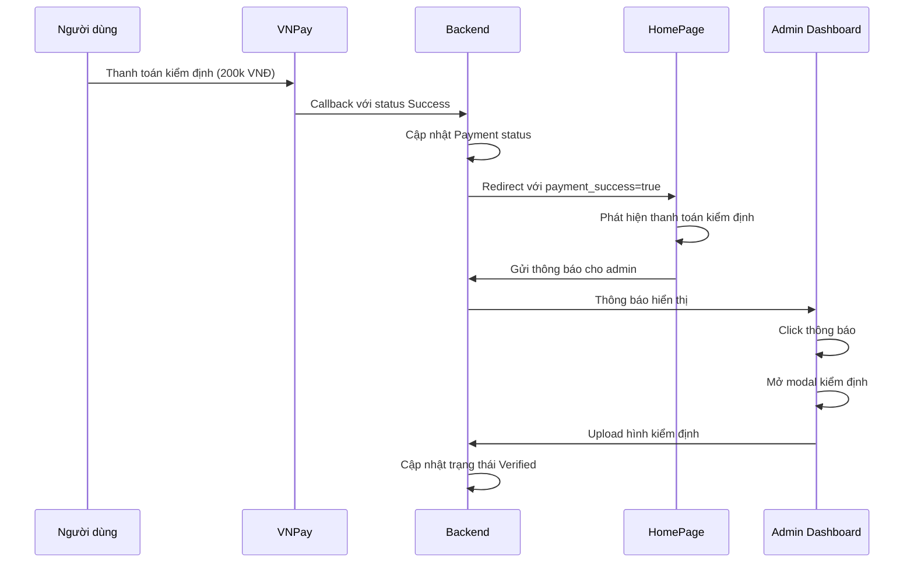

# 🔔 Verification Payment Notification System

## Tổng quan

Hệ thống thông báo tự động cho admin khi có thanh toán kiểm định thành công. Khi người dùng thanh toán 200.000 VNĐ cho dịch vụ kiểm định xe, admin sẽ nhận được thông báo và có thể thực hiện kiểm định ngay lập tức.

## 🚀 Tính năng

### 1. **Tự động phát hiện thanh toán kiểm định**
- Phát hiện khi thanh toán có `PaymentType: 'Verification'` và `PaymentStatus: 'Success'`
- Tự động gửi thông báo cho admin
- Cập nhật trạng thái sản phẩm thành "Requested" để admin biết cần kiểm định

### 2. **Thông báo real-time cho admin**
- Thông báo hiển thị trong Admin Dashboard
- Bell icon với số lượng thông báo chưa đọc
- Dropdown hiển thị danh sách thông báo
- Click thông báo để mở modal kiểm định

### 3. **Workflow kiểm định tích hợp**
- Admin click thông báo → Mở modal kiểm định
- Upload hình ảnh kiểm định
- Hoàn thành kiểm định → Cập nhật trạng thái "Verified"

## 📁 Cấu trúc file

```
src/
├── lib/
│   ├── notificationApi.js                    # API thông báo
│   └── verificationNotificationService.js   # Service xử lý thông báo kiểm định
├── pages/
│   ├── HomePage.jsx                         # Xử lý callback thanh toán
│   └── AdminDashboard.jsx                   # Hiển thị thông báo cho admin
└── components/
    └── common/
        └── NotificationBell.jsx              # Component chuông thông báo
```

## 🔄 Quy trình hoạt động



## 🛠️ Cài đặt và sử dụng

### 1. **Cấu hình API**

Đảm bảo backend có các endpoint:
- `POST /api/Notification` - Tạo thông báo
- `GET /api/Notification/user/{userId}` - Lấy thông báo của user
- `GET /api/Payment/{paymentId}` - Lấy thông tin thanh toán
- `GET /api/Product/{productId}` - Lấy thông tin sản phẩm
- `GET /api/User/{userId}` - Lấy thông tin người dùng

### 2. **Cấu hình Admin User**

Hệ thống tự động tìm admin user dựa trên:
- `role === 'admin'` hoặc `role === 'Admin'`
- `isAdmin === true`
- Email chứa từ "admin"
- FullName chứa từ "Admin"

Fallback: Sử dụng user đầu tiên làm admin.

### 3. **Test hệ thống**

Mở file `test_verification_notification_system.html` để test:
- Tạo thông báo kiểm định
- Kiểm tra thông báo admin
- Test workflow hoàn chỉnh

## 📊 Dashboard Admin

### Thống kê mới
- **PENDING INSPECTIONS**: Số sản phẩm cần kiểm định
- **RECENT NOTIFICATIONS**: Số thông báo chưa đọc

### Thông báo
- Bell icon với badge số lượng chưa đọc
- Dropdown hiển thị danh sách thông báo
- Click để mở modal kiểm định
- Highlight thông báo chưa đọc

## 🔧 API Functions

### `handleVerificationPaymentSuccess(paymentId, productId, sellerId, amount)`
Xử lý thông báo khi thanh toán kiểm định thành công.

**Parameters:**
- `paymentId`: ID thanh toán
- `productId`: ID sản phẩm
- `sellerId`: ID người bán
- `amount`: Số tiền thanh toán

**Returns:** `Promise<boolean>`

### `notifyAdminVerificationPaymentSuccess(adminUserId, productTitle, productId, sellerName, amount)`
Gửi thông báo cho admin về thanh toán kiểm định thành công.

**Parameters:**
- `adminUserId`: ID admin
- `productTitle`: Tên sản phẩm
- `productId`: ID sản phẩm
- `sellerName`: Tên người bán
- `amount`: Số tiền

**Returns:** `Promise<boolean>`

## 🎯 Notification Types

```javascript
export const NOTIFICATION_TYPES = {
  POST_CREATED: "post_created",
  POST_APPROVED: "post_approved", 
  POST_REJECTED: "post_rejected",
  POST_SOLD: "post_sold",
  MESSAGE_RECEIVED: "message_received",
  SYSTEM_ANNOUNCEMENT: "system_announcement",
  VERIFICATION_PAYMENT_SUCCESS: "verification_payment_success", // Mới thêm
  TEST: "test"
};
```

## 🚨 Xử lý lỗi

- **Lỗi API**: Log lỗi nhưng không hiển thị cho user
- **Không tìm thấy admin**: Sử dụng user đầu tiên làm admin
- **Lỗi cập nhật sản phẩm**: Thông báo vẫn được gửi thành công
- **Lỗi load thông báo**: Hiển thị trạng thái fallback

## 🔍 Debug

### Console Logs
- `🔔` - Notification related logs
- `🔍` - Payment detection logs
- `✅` - Success operations
- `❌` - Error operations

### Test Commands
```javascript
// Test tạo thông báo
await notifyAdminVerificationPaymentSuccess(1, "Test Product", 123, "Test Seller", 200000);

// Test xử lý thanh toán
await handleVerificationPaymentSuccess("PAY_123", 123, 456, 200000);

// Test load thông báo admin
await getUserNotifications(1);
```

## 📈 Monitoring

### Metrics cần theo dõi
- Số lượng thông báo kiểm định được gửi
- Thời gian phản hồi của admin
- Tỷ lệ hoàn thành kiểm định
- Lỗi trong quá trình gửi thông báo

### Alerts
- Thông báo không được gửi sau 5 phút
- Admin không phản hồi sau 24 giờ
- Lỗi API notification liên tục

## 🔮 Tương lai

### Tính năng có thể mở rộng
- **Email notifications**: Gửi email cho admin
- **SMS notifications**: Gửi SMS cho admin
- **Push notifications**: Thông báo real-time
- **Auto-assignment**: Tự động phân công admin kiểm định
- **Priority system**: Ưu tiên thông báo theo mức độ
- **Analytics**: Thống kê hiệu suất kiểm định

### Cải tiến UI/UX
- **Real-time updates**: WebSocket cho thông báo real-time
- **Bulk actions**: Xử lý nhiều kiểm định cùng lúc
- **Mobile responsive**: Tối ưu cho mobile
- **Dark mode**: Chế độ tối cho admin dashboard

---

## 📞 Hỗ trợ

Nếu gặp vấn đề với hệ thống thông báo:
1. Kiểm tra console logs
2. Test với file `test_verification_notification_system.html`
3. Kiểm tra API endpoints
4. Xác nhận admin user ID

**Happy coding! 🚀**

